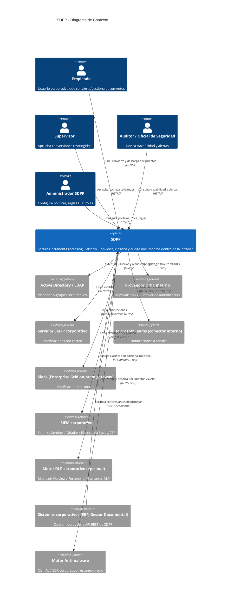
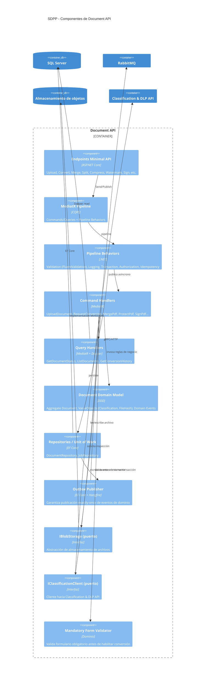

# Diagramas C4

## Nivel 1 — Contexto del sistema

Todos los sistemas externos son **internos a la red corporativa** o alcanzables solo vía relay
interno; no existe ninguna dependencia de servicio SaaS público para el procesamiento de
contenido.

## Nivel 2 — Contenedores

```mermaid
C4Container
title SDPP - Diagrama de Contenedores

Person(user, "Usuario / Sistema externo")

System_Boundary(sdpp, "SDPP") {
    Container(spa, "SPA Web", "React 18 + TypeScript + MUI", "UI de conversión, dashboard, administración")
    Container(bff, "API Gateway / BFF", "ASP.NET Core 9, YARP", "Enrutamiento, agregación, rate limiting, terminación TLS")
    Container(identity, "Identity Service", "ASP.NET Core 9, OpenIddict", "Emisión/validación de tokens OIDC, integración AD/LDAP")
    Container(docapi, "Document API", "ASP.NET Core 9, CQRS/MediatR", "Casos de uso de subida, conversión, gestión de documentos")
    Container(classapi, "Classification & DLP API", "ASP.NET Core 9, CQRS/MediatR", "Inspección, clasificación, reglas DLP, políticas")
    Container(auditapi, "Audit & Traceability API", "ASP.NET Core 9", "Registro inmutable, consulta de trazabilidad, alertas")
    Container(adminapi, "Admin & RBAC API", "ASP.NET Core 9", "Gestión de roles, usuarios, políticas, configuración")
    Container(notifapi, "Notification Service", "ASP.NET Core 9, Hangfire", "Envío de correo, Teams, Slack, Syslog/SIEM")
    Container(worker, "Conversion Worker Pool", "Worker Service .NET, Hangfire", "Ejecuta LibreOffice/Ghostscript/Poppler/Tesseract en sandbox")
    Container(gateway_mq, "Message Broker", "RabbitMQ", "Colas de jobs y eventos de dominio (outbox)")
    ContainerDb(sql, "SQL Server", "SQL Server 2022 AG", "Documentos (metadata), trazabilidad, auditoría, RBAC, políticas")
    ContainerDb(redis, "Redis", "Redis Cluster", "Caché, sesiones, rate limiting, locks distribuidos")
    ContainerDb(blob, "Almacenamiento de objetos", "MinIO on-prem (S3 compatible) / NAS cifrado", "Archivos originales y convertidos, cifrados AES-256")
    Container(dashboard, "Reporting/Dashboard API", "ASP.NET Core 9, proyecciones CQRS", "Indicadores ejecutivos")
}

System_Ext(ad, "Active Directory/LDAP")
System_Ext(siem, "SIEM")
System_Ext(av, "Antimalware")
System_Ext(mon, "Prometheus / Grafana")
System_Ext(log, "Serilog Sink (Elasticsearch/Seq)")

Rel(user, spa, "HTTPS")
Rel(spa, bff, "HTTPS/JSON, WebSocket (progreso)")
Rel(bff, identity, "Valida token", "HTTPS")
Rel(bff, docapi, "HTTPS/JSON")
Rel(bff, classapi, "HTTPS/JSON")
Rel(bff, auditapi, "HTTPS/JSON")
Rel(bff, adminapi, "HTTPS/JSON")
Rel(bff, dashboard, "HTTPS/JSON")

Rel(identity, ad, "LDAPS / Kerberos")

Rel(docapi, classapi, "Solicita inspección previa (sync)", "gRPC/HTTP interno")
Rel(docapi, gateway_mq, "Publica DocumentUploaded / ConversionRequested")
Rel(gateway_mq, worker, "Consume ConversionRequested")
Rel(worker, classapi, "Reporta resultado inspección post-conversión")
Rel(worker, av, "Escanea archivo", "ICAP")
Rel(worker, blob, "Lee/escribe archivos")
Rel(worker, gateway_mq, "Publica ConversionCompleted/Failed")

Rel(classapi, gateway_mq, "Publica SensitiveDocumentDetected")
Rel(gateway_mq, auditapi, "Consume todos los eventos de dominio (append-only)")
Rel(gateway_mq, notifapi, "Consume SensitiveDocumentDetected, ApprovalRequired")
Rel(notifapi, siem, "Syslog/CEF")

Rel(docapi, sql, "EF Core")
Rel(classapi, sql, "EF Core")
Rel(auditapi, sql, "EF Core, append-only")
Rel(adminapi, sql, "EF Core")
Rel(dashboard, sql, "Dapper, réplica de lectura")
Rel(docapi, redis, "Caché / locks")
Rel(bff, redis, "Rate limiting / sesión")
Rel(docapi, blob, "Lee/escribe archivos")

Rel(docapi, log, "Serilog")
Rel(classapi, log, "Serilog")
Rel(worker, log, "Serilog")
Rel(docapi, mon, "métricas /metrics")
Rel(worker, mon, "métricas /metrics")
```

## Nivel 3 — Componentes (Document API)

## Nivel 4 — Nota sobre diagramas de despliegue

El diagrama de despliegue en Kubernetes (namespaces, NetworkPolicies, nodepools) se documenta en
[07-operations/kubernetes-architecture.md](../07-operations/kubernetes-architecture.md) para
mantener este documento centrado en la arquitectura lógica.
