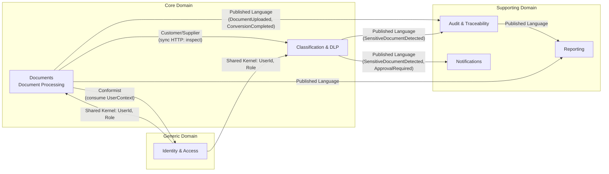
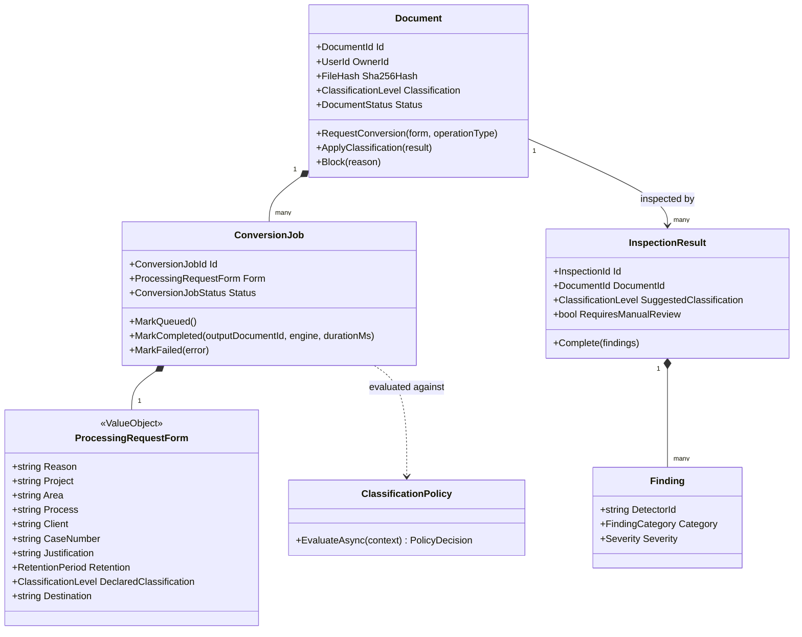

# Modelo de dominio (DDD táctico)

## 1. Bounded Contexts y mapa de contexto



**Core Domain** (donde vive la ventaja competitiva/razón de ser del proyecto): `Documents` y
`Classification & DLP`. Reciben la mayor inversión de diseño.

**Supporting Domain**: `Audit`, `Notifications`, `Reporting` — necesarios pero no diferenciadores;
se implementan de forma directa y desacoplada vía eventos.

**Generic Domain**: `Identity & Access` — se apoya en AD/LDAP + un broker OIDC estándar
(OpenIddict/Keycloak), sin reinventar gestión de identidades.

## 2. Bounded Context: Documents (Core)

### 2.1 Lenguaje ubicuo
- **Document**: archivo original subido por un usuario, con su metadata y clasificación.
- **ConversionJob**: solicitud de transformar uno o más `Document` en un formato/operación
  destino (conversión de formato, unión, división, marca de agua, etc.).
- **ProcessingRequestForm**: formulario obligatorio (motivo, proyecto, área, proceso, cliente,
  caso, justificación, retención, clasificación, destino) que debe estar completo y válido antes
  de que un `ConversionJob` pueda pasar a estado `Queued`.
- **OutputDocument**: archivo resultante de un `ConversionJob` exitoso, con su propio hash,
  etiqueta y clasificación heredada/revisada.

### 2.2 Agregado raíz: `Document`

```
Document (AggregateRoot)
├── Id: DocumentId (Guid)
├── OwnerId: UserId
├── OriginalFileName: string
├── ContentType: string
├── SizeBytes: long
├── Sha256Hash: FileHash (VO)
├── StorageLocation: StoragePath (VO)          — referencia opaca al blob store, nunca ruta de FS directa
├── Classification: ClassificationLevel (VO)     — nivel actual (puede evolucionar)
├── ClassificationSource: enum {Manual, Automatic, Hybrid}
├── PageCount: int?
├── Status: enum {Uploaded, Inspecting, Blocked, Ready, Archived, PendingDeletion, Deleted}
├── RetentionPolicy: RetentionPeriod (VO)
├── CreatedAtUtc / CreatedBy
├── Jobs: IReadOnlyList<ConversionJob>           — entidades hijas dentro del mismo agregado
└── DomainEvents: DocumentUploaded, DocumentClassified, DocumentBlocked, DocumentArchived
```

**Invariantes (reglas de negocio garantizadas por el agregado, no por la capa de aplicación):**
1. Un `Document` no puede tener `Status = Ready` si `ClassificationSource = Automatic` y el
   resultado de inspección indica hallazgos de severidad `Critical` sin revisión manual
   (`RequiresManualReview = true`).
2. `Sha256Hash` es inmutable una vez calculado; cualquier reemplazo de contenido crea un nuevo
   `Document` (versión), nunca sobrescribe.
3. No se puede iniciar un `ConversionJob` si el `Document` está en estado `Blocked` o si no existe
   un `ProcessingRequestForm` válido asociado al job.
4. `RetentionPolicy` no puede ser nula para documentos con `Classification >= Confidencial`.

### 2.3 Entidad interna: `ConversionJob`

```
ConversionJob (Entity, hijo de Document)
├── Id: ConversionJobId
├── DocumentId: DocumentId
├── OperationType: enum {WordToPdf, ExcelToPdf, PptToPdf, ImageToPdf, PdfToWord, PdfToExcel,
│                        PdfToImage, PdfToPpt, Merge, Split, Compress, Ocr, Watermark,
│                        PageNumbering, Rotate, DigitalSign, DeletePages, ReorderPages,
│                        Protect, Unlock, BulkConvert}
├── Form: ProcessingRequestForm (VO, embebido)
├── Status: enum {PendingForm, Queued, Inspecting, Approved, AwaitingApproval, Rejected,
│                 Processing, Completed, Failed}
├── EngineUsed: string?                          — p.ej. "LibreOffice 7.6", "Ghostscript 10.x"
├── DurationMs: int?
├── OutputDocumentId: DocumentId?
├── ErrorDetail: string?
├── ApprovalRequired: bool
├── ApprovedBy: UserId?
└── DomainEvents: ConversionRequested, ConversionApproved, ConversionRejected,
                   ConversionCompleted, ConversionFailed
```

### 2.4 Value Objects clave

| VO | Reglas |
|---|---|
| `FileHash` | SHA-256, 64 chars hex, calculado server-side sobre el stream original (nunca confiar en hash enviado por el cliente). |
| `ClassificationLevel` | Enum ordenado: `Publica(0) < UsoInterno(1) < Privada(2) < Confidencial(3) < Restringida(4) < Secreta(5)`. Comparable — permite reglas "no degradar clasificación". |
| `ProcessingRequestForm` | Todos los campos obligatorios (ver [use-cases](../04-use-cases/use-cases.md#formulario-obligatorio)); se valida con FluentValidation + invariante de dominio redundante (defensa en profundidad). |
| `RetentionPeriod` | Duración + acción al vencer (`Delete`, `Archive`, `ReviewRequired`). |
| `StoragePath` | Identificador opaco (no expone ruta física), incluye `bucket`/`container` + `objectKey` versionado. |

### 2.5 Eventos de dominio → eventos de integración

| Evento de dominio (dentro del agregado) | Evento de integración publicado (RabbitMQ, contrato versionado) | Consumidores |
|---|---|---|
| `DocumentUploaded` | `Documents.DocumentUploaded.v1` | Classification, Audit |
| `ConversionRequested` | `Documents.ConversionRequested.v1` | Conversion Worker, Audit |
| `ConversionCompleted` | `Documents.ConversionCompleted.v1` | Audit, Reporting, Notifications (si clasificación sensible) |
| `ConversionFailed` | `Documents.ConversionFailed.v1` | Audit, Reporting |
| `DocumentBlocked` | `Documents.DocumentBlocked.v1` | Audit, Notifications |

## 3. Bounded Context: Classification & DLP (Core)

```
InspectionResult (AggregateRoot)
├── Id: InspectionId
├── DocumentId: DocumentId
├── TriggeredBy: enum {PreConversion, PostConversion, Scheduled}
├── SuggestedClassification: ClassificationLevel
├── FinalClassification: ClassificationLevel        — tras posible revisión manual
├── Findings: IReadOnlyList<Finding>                 — entidades hijas
├── RequiresManualReview: bool
├── Status: enum {Pending, Completed, Overridden, Failed}
└── DomainEvents: InspectionCompleted, SensitiveDataDetected, ClassificationOverridden

Finding (Entity)
├── DetectorId: string           — p.ej. "PII.CreditCard", "PII.NationalId", "Secrets.PrivateKey"
├── Category: enum {PII, Financial, Medical, Legal, SourceCode, IntellectualProperty, Credentials, Strategic}
├── Severity: enum {Info, Low, Medium, High, Critical}
├── MatchCount: int
├── Location: string             — p.ej. "página 3", "metadato Author", "nombre de archivo"
└── RuleVersion: string          — trazabilidad de qué versión de regla produjo el hallazgo

ClassificationPolicy (AggregateRoot)  — configuración, no ejecución
├── Id
├── Name / Description
├── Scope: {Global, Area, Project}
├── Rules: IReadOnlyList<PolicyRule>   — "Confidencial no puede convertirse a Imagen",
│                                        "Restringida solo procesable por área=Legal"
├── Active: bool
└── Version: int                        — versionado de políticas, auditable

DlpRule (Entity, catálogo configurable)
├── Id / Name
├── DetectorType: enum {Regex, Keyword, Checksum(Luhn), Dictionary, MLModel, ExternalDlpEngine}
├── Pattern / Configuration (JSON)
├── Category: (igual que Finding.Category)
├── DefaultSeverity
└── Enabled: bool
```

**Invariante clave**: `ClassificationPolicy` se evalúa como un *policy engine* (Specification
pattern) independiente del motor de detección; permite componer reglas del tipo "SI
clasificación ∈ {Confidencial, Restringida, Secreta} Y operación = PdfToImage ENTONCES bloquear"
o "SI clasificación = Restringida ENTONCES requiere aprobación de Supervisor del área declarada
en el formulario", sin tocar código (ver [policy-engine en dlp-engine.md](../05-security/dlp-engine.md)).

## 4. Bounded Context: Audit & Traceability (Supporting, pero crítico para cumplimiento)

```
AuditRecord (AggregateRoot, append-only — nunca Update/Delete)
├── Id: AuditRecordId (secuencial + Guid)
├── OccurredAtUtc
├── EventType: string                — "ConversionCompleted", "UserLogin", "PermissionChanged"...
├── ActorUserId / ActorFullName / ActorEmail / ActorDomain
├── ActorIp / ActorMac? / ActorHostname / ActorOs / ActorUserAgent
├── SubjectDocumentId?
├── PayloadJson: string              — snapshot inmutable del evento (esquema por EventType)
├── PreviousRecordHash: string       — hash chain (ver audit-and-traceability.md §2)
└── RecordHash: string               — SHA-256(PreviousRecordHash + PayloadJson + metadata)
```

Se modela deliberadamente como un **log de eventos con hash-chain**, no como entidad CRUD, para
soportar el requisito de inmutabilidad (ver detalle en
[05-security/audit-and-traceability.md](../05-security/audit-and-traceability.md)).

## 5. Bounded Context: Identity & Access (Generic)

```
User (Entity, proyección local de AD — no fuente de verdad)
├── Id: UserId (mapeado a objectSid/sAMAccountName de AD)
├── FullName / Email / Domain / Department
├── Roles: IReadOnlyList<RoleAssignment>
└── LastSyncedAtUtc

Role / Permission — ver matriz RBAC en 05-security/rbac-matrix.md

ApprovalRequest (AggregateRoot)
├── Id
├── ConversionJobId
├── RequestedBy / RequestedAtUtc
├── RequiredApproverRole: Role
├── Status: enum {Pending, Approved, Rejected, Expired}
├── DecidedBy? / DecidedAtUtc? / Comment?
└── DomainEvents: ApprovalRequested, ApprovalGranted, ApprovalRejected, ApprovalExpired
```

## 6. Servicios de dominio (no pertenecen a ningún agregado)

| Servicio | Responsabilidad |
|---|---|
| `IClassificationPolicyEvaluator` | Dado (Classification, OperationType, Actor, Area) devuelve `Allow / Block / RequireApproval`. |
| `IRetentionScheduler` | Calcula próxima fecha de revisión/eliminación según `RetentionPeriod`. |
| `IDocumentLabelingService` | Genera el contenido de etiqueta (pie de página/encabezado/marca de agua/metadatos) a partir de `Document` + `InspectionResult` + `ActorContext`. |
| `IHashChainService` | Calcula y valida la cadena de hashes de `AuditRecord`. |

## 7. Diagrama de clases simplificado (Documents + Classification)


