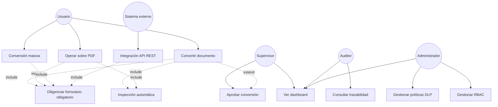

# Casos de uso

## 1. Actores

| Actor | Descripción |
|---|---|
| **Usuario** | Empleado corporativo autenticado que sube y convierte documentos propios. |
| **Supervisor** | Aprueba/rechaza conversiones que requieren autorización (clasificación Restringida/Secreta o política de área). |
| **Auditor / Oficial de Seguridad** | Solo lectura sobre trazabilidad, auditoría y alertas; no puede convertir ni administrar. |
| **Administrador** | Configura políticas, reglas DLP, roles, usuarios, integraciones. |
| **Invitado** | Acceso muy limitado (p. ej. visualizar el estado de un job compartido), sin permisos de subida. |
| **Sistema externo** | Consume la API REST con credenciales de aplicación (client credentials OAuth2) para conversión por lotes. |

## 2. Formulario obligatorio

Antes de que cualquier `ConversionJob` pueda pasar a `Queued`, el `Usuario` debe diligenciar:

| Campo | Tipo | Validación |
|---|---|---|
| Motivo de la conversión | Enum + texto libre si "Otro" | Obligatorio |
| Proyecto | Texto / selector (integrable con PMO) | Obligatorio |
| Área | Selector (sincronizado con AD OU / atributo `department`) | Obligatorio |
| Proceso | Texto / selector | Obligatorio |
| Cliente | Texto / selector (integrable con CRM) | Opcional si Área ≠ comercial/legal, obligatorio en caso contrario (regla configurable) |
| Número de caso | Texto (formato validado por regex configurable, p. ej. ticket de ITSM) | Obligatorio si aplica política del área |
| Justificación | Texto libre, mínimo 20 caracteres | Obligatorio |
| Tiempo de conservación | Selector (30/90/180/365 días, "Permanente", "Personalizado") | Obligatorio |
| Clasificación de la información | Selector de las 6 clasificaciones (pre-rellenado por inspección automática, editable con motivo si difiere) | Obligatorio |
| Destino del documento | Selector (Uso interno, Envío a cliente, Envío a proveedor, Repositorio legal, Archivo histórico, Otro) | Obligatorio |

**Regla dura**: si algún campo obligatorio falta o es inválido, la API rechaza la creación del
job con `422 Unprocessable Entity` y el frontend no permite avanzar el wizard. Esta regla se
aplica **tres veces** (defensa en profundidad): validación de formulario en React, `FluentValidation`
en el `Command`, y `CHECK` constraint en `PROCESSING_REQUEST_FORMS` (ver
[er-model.md](../03-data/er-model.md)).

## 3. Casos de uso principales

### UC-01 — Convertir documento (flujo estándar)
**Actor**: Usuario. **Precondición**: sesión válida, cuota no excedida.
1. Usuario sube archivo (o selecciona uno ya almacenado).
2. Sistema calcula SHA-256, valida tipo MIME real (no solo extensión — *magic bytes*), tamaño
   máximo, y ejecuta escaneo antimalware (ClamAV/EDR).
3. Sistema ejecuta inspección automática (Classification & DLP) → clasificación sugerida +
   hallazgos.
4. Usuario diligencia el formulario obligatorio (clasificación pre-rellenada, editable con
   motivo).
5. Sistema evalúa `ClassificationPolicy`: `Allow` / `Block` / `RequireApproval`.
   - Si `Block`: se informa al usuario, se registra auditoría, no se permite continuar.
   - Si `RequireApproval`: se crea `ApprovalRequest`, se notifica al Supervisor del área, job
     queda `AwaitingApproval`.
   - Si `Allow`: job pasa a `Queued`.
6. Worker de conversión procesa el job con el motor correspondiente, en sandbox aislado.
7. Sistema aplica etiquetado automático al `OutputDocument`.
8. Sistema registra `AuditRecord` completo, calcula hash del archivo resultante.
9. Si la clasificación final es ≥ Confidencial, se disparan alertas multicanal.
10. Usuario descarga el resultado (descarga también auditada).

**Flujos alternativos**: `3a` inspección detecta hallazgo `Critical` → `RequiresManualReview =
true`, formulario obliga a declarar clasificación manual antes de continuar. `6a` motor de
conversión falla / timeout → job `Failed`, se notifica al usuario, se registra `ConversionFailed`.

### UC-02 — Operaciones sobre PDF (unir, dividir, comprimir, OCR, marca de agua, numeración,
rotar, eliminar/reordenar páginas, proteger, desbloquear, firmar)
Mismo flujo que UC-01 desde el paso 2 en adelante; cada operación es un `OperationType` distinto
del mismo agregado `ConversionJob`. Variaciones notables:
- **Desbloquear PDF** requiere que el usuario aporte la contraseña actual; el sistema **no**
  intenta fuerza bruta. Esta operación queda marcada con severidad de auditoría elevada por
  defecto (manipulación de protección existente).
- **Firma digital** requiere certificado del usuario (token/HSM corporativo) o firma con sello
  institucional (rol autorizado); se registra el certificado usado y su huella digital (thumbprint) en la traza.

### UC-03 — Conversión masiva / procesamiento por lotes
Actor: Usuario o Sistema externo (API). Se sube un ZIP o se referencian múltiples `DocumentId`;
se crea un `ConversionJob` por archivo (mismo formulario aplicado a todo el lote, con posibilidad
de clasificación individual si la inspección detecta diferencias). El lote expone un
`BatchId` para seguimiento agregado.

### UC-04 — Aprobación de conversión restringida
Actor: Supervisor. Ve cola de `ApprovalRequest` pendientes de su área, revisa metadata del
documento (nunca el contenido completo si la clasificación es Secreta, salvo permiso explícito),
aprueba o rechaza con comentario obligatorio si rechaza. Expira automáticamente a las 48h
(configurable) generando alerta.

### UC-05 — Consulta de trazabilidad
Actor: Auditor. Busca por usuario, documento (hash), rango de fechas, clasificación, tipo de
evento. Exporta evidencia (paquete firmado: registros + hash-chain verificable) para una
investigación o auditoría externa.

### UC-06 — Gestión de políticas y reglas DLP
Actor: Administrador. CRUD de `ClassificationPolicy`, `PolicyRule`, `DlpRule`; toda modificación
queda versionada y auditada (evento `PermissionChanged`/`ConfigurationChanged`); requiere doble
aprobación (cuatro ojos) para reglas que bajen el nivel de restricción de forma masiva.

### UC-07 — Gestión de roles y usuarios (RBAC)
Actor: Administrador. Asigna roles a usuarios (sincronizados desde AD, no se crean usuarios
locales); no puede auto-asignarse el rol Administrador (control de escalamiento de privilegios,
requiere segunda persona).

### UC-08 — Dashboard ejecutivo
Actor: Supervisor, Auditor, Administrador (según alcance de datos permitido por RBAC + RLS). Ver
[dashboard-spec.md](dashboard-spec.md).

### UC-09 — Integración vía API REST
Actor: Sistema externo. Autenticación `client_credentials`, mismo pipeline de clasificación/DLP y
formulario obligatorio (enviado como payload estructurado), mismas garantías de auditoría. Rate
limit propio por `client_id`.

## 4. Diagrama de casos de uso

