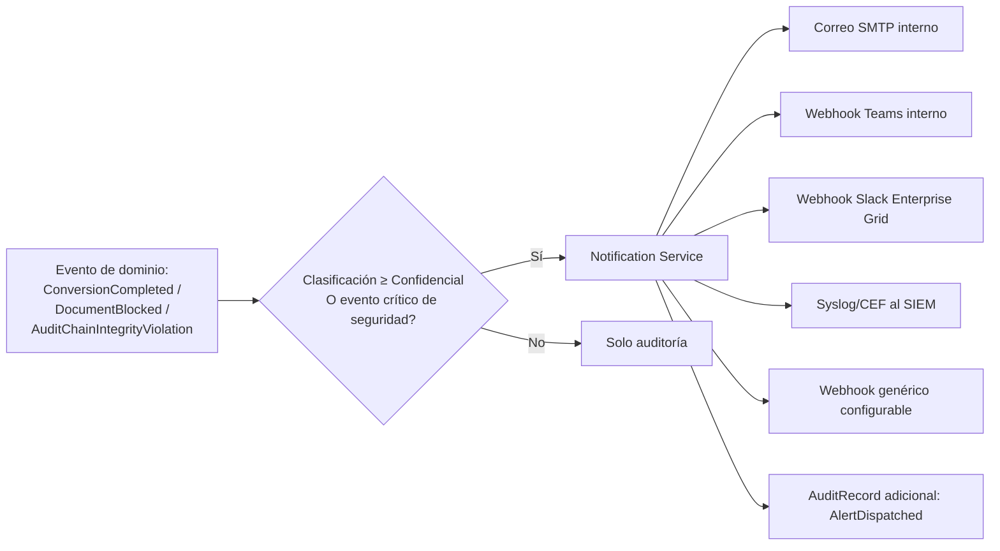

# Trazabilidad, auditoría inmutable, etiquetado y alertas

## 1. Datos capturados por evento de procesamiento

Conforme al requisito, cada conversión registra (tabla `AUDIT_RECORDS.PayloadJson`, esquema por
`EventType`):

**Identidad del actor**: UserId, Nombre completo, Correo, Dominio AD, Equipo (hostname), IP de
origen, MAC (cuando la resuelve el switch/DHCP corporativo vía integración con NAC — no siempre
disponible desde HTTP, se documenta como *best-effort*, ver §1.1), Sistema operativo (parseado de
User-Agent + Client Hints), Navegador.

**Temporalidad**: Fecha, hora, zona horaria (almacenada en UTC + offset del cliente).

**Documento origen**: nombre, hash SHA-256, peso, tipo MIME real, cantidad de páginas.

**Resultado de gobierno**: clasificación, resultado completo de inspección (`InspectionResult` +
`Finding[]`), motivo de la conversión (formulario completo referenciado).

**Ejecución**: herramienta/motor utilizado, tiempo del proceso, resultado (éxito/error), detalle
de error.

**Documento resultante**: archivo generado, hash SHA-256 del nuevo archivo.

### 1.1 Nota honesta sobre MAC address
La dirección MAC del cliente **no es visible a nivel de aplicación HTTP** (se pierde en el salto
de routers/switches). Se captura de forma *best-effort* solo si existe integración con el sistema
NAC corporativo (802.1X) que exponga una API de resolución IP→MAC en el mismo instante de la
petición; si no está disponible, el campo queda `null` con un flag `MacResolutionMethod = "N/A"`.
Esto se documenta explícitamente para no generar una falsa sensación de trazabilidad completa.

## 2. Inmutabilidad — diseño de hash-chain

```
RecordHash[n] = SHA256( RecordHash[n-1] || EventType[n] || OccurredAtUtc[n] || PayloadJson[n] )
```

- `RecordHash[0]` (génesis) es una constante fija sembrada en el despliegue inicial y documentada
  fuera de la base de datos (en el repositorio de configuración segura / Vault).
- Cada inserción calcula el hash en la misma transacción de escritura (dentro del `SaveChanges`
  vía interceptor de EF Core), leyendo el último `RecordHash` con `UPDLOCK, ROWLOCK` para evitar
  condiciones de carrera en inserciones concurrentes (serialización controlada solo para esta
  tabla — el resto del sistema no se ve afectado en throughput).
- Un job Hangfire (`ValidateAuditChainJob`, cada 15 min) recalcula y compara la cadena completa
  del período reciente; ante una discrepancia, genera un evento `AuditChainIntegrityViolation` con
  severidad `Critical` (ver §5).
- Exportación de evidencia (UC-05) incluye el rango de registros + los hashes adyacentes, para que
  un tercero (auditor externo, perito) pueda verificar la cadena sin acceso a la base de datos
  viva.

## 3. Inmutabilidad a nivel de plataforma (defensa en profundidad)

No basta con "no exponer un endpoint de UPDATE": se refuerza a nivel de plataforma.

1. **Permisos SQL**: el login de aplicación (`sdpp_audit_svc`) tiene `GRANT INSERT, SELECT` y
   **`DENY UPDATE, DELETE`** explícito sobre `AUDIT_RECORDS`. Ni un bug de aplicación ni una
   inyección SQL exitosa podrían alterar/borrar registros con ese principal.
2. **Trigger `INSTEAD OF UPDATE/DELETE`** que rechaza la operación y registra el intento como
   evento de seguridad (protección incluso contra un DBA con acceso directo, salvo `sysadmin`,
   lo cual queda cubierto por separación de funciones y monitoreo de accesos privilegiados —
   control organizacional, no solo técnico).
3. Backups periódicos con **WORM** (Write Once Read Many) en el almacenamiento de respaldo para
   esta tabla/partición específica (ver [backup-recovery-plan.md](../07-operations/backup-recovery-plan.md)).

## 4. Etiquetado automático

Servicio de dominio `IDocumentLabelingService` (ver [domain-model.md §6](../02-domain/domain-model.md#6-servicios-de-dominio-no-pertenecen-a-ningún-agregado))
genera, tras cada conversión exitosa, el siguiente contenido y lo aplica según el mecanismo
configurado:

```
Clasificación: CONFIDENCIAL
Procesado por: Secure Document Processing Platform (SDPP)
Usuario: Juan Pérez (juan.perez@empresa.com)
Fecha: 2026-07-25 14:32 (America/Bogota)
ID de proceso: 7f3a2c1e-...
Hash SHA-256: 9f86d081884c7d659a2feaa0c55ad015a3bf4f1b2b0b822cd15d6c15b0f00a08
```

| Mecanismo | Cuándo se aplica | Implementación |
|---|---|---|
| Pie de página | PDF de salida, por defecto para clasificación ≥ Uso Interno | PDFBox: contenido añadido en cada página |
| Encabezado | Alternativa configurable | PDFBox |
| Marca de agua | Clasificación ≥ Confidencial (adicional al pie de página, no sustituto) | PDFBox, diagonal, semitransparente |
| Metadatos PDF (Info dictionary) | Siempre | `/Keywords`, `/Subject` con clasificación + hash |
| XMP Metadata | Siempre, para interoperabilidad con DLP/Purview de terceros | Namespace custom `sdpp:classification`, `sdpp:processId`, `sdpp:hash` |

Para formatos no-PDF de salida (Word/Excel/PPT), el etiquetado usa las propiedades de documento
nativas (Core Properties + Custom XML Parts de OOXML) ya que no existe "marca de agua" nativa
uniforme; se documenta como limitación conocida y candidato a mejora (conversión a PDF recomendada
para máxima garantía de etiquetado visible).

## 5. Alertas



- Cada alerta se registra en `NOTIFICATION_LOG` con reintentos (backoff exponencial, máx. 5
  intentos) y circuit breaker por canal (Polly) para que la caída de un canal no bloquee los
  demás.
- Severidad de evento determina urgencia y canal: `Critical` (p. ej. hallazgo Secreta, ruptura de
  cadena de auditoría) → todos los canales + SIEM inmediato; `High` (Restringida) → correo +
  Teams/Slack del área; `Medium` (Confidencial) → correo al usuario y su supervisor directo.
- Formato SIEM: **CEF sobre Syslog TLS** (compatible con Splunk, QRadar, Sentinel, Elastic) con
  campos estándar (`src`, `suser`, `act`, `outcome`, `cs1Label=Classification`, `cs1=...`).

## 6. Retención de la propia auditoría
La tabla de auditoría en sí tiene retención mínima de 7 años (ajustable a normativa local/sector),
independiente de la `RetentionPeriod` del documento — el registro de que algo ocurrió sobrevive
aunque el documento se elimine por vencimiento de retención (ver
[backup-recovery-plan.md](../07-operations/backup-recovery-plan.md)).
