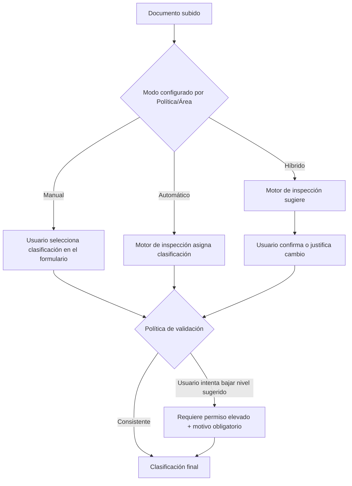
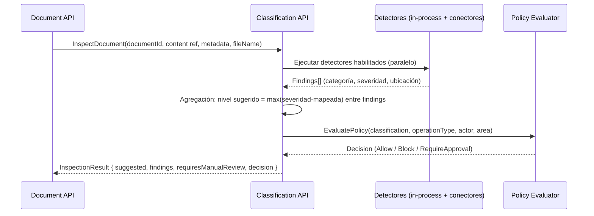

# Motor de clasificación e inspección automática

## 1. Niveles de clasificación

| Nivel | Valor | Descripción | Ejemplo típico |
|---|---|---|---|
| Pública | 0 | Puede divulgarse sin restricción. | Comunicados de prensa, folletos. |
| Uso Interno | 1 | Solo para colaboradores; sin impacto grave si se filtra. | Procedimientos internos generales. |
| Privada | 2 | Datos personales de colaboradores/terceros no críticos. | Datos de contacto de empleados. |
| Confidencial | 3 | Impacto significativo si se filtra (negocio, contractual). | Contratos, propuestas comerciales. |
| Restringida | 4 | Acceso limitado a roles/áreas específicas; impacto alto. | Información financiera no pública, estrategia. |
| Secreta | 5 | Máximo impacto; compromiso de la organización. | Fusiones/adquisiciones, secretos industriales, credenciales maestras. |

La clasificación es **comparable y ordenada** (`ClassificationLevel` VO); las políticas nunca
pueden hacer que el sistema baje automáticamente una clasificación — solo puede subirla o
requerir revisión manual explícita para bajarla.

## 2. Modos de clasificación

- **Manual**: el usuario declara la clasificación; el motor igual ejecuta inspección en
  background y, si detecta un nivel superior al declarado, marca `RequiresManualReview = true` y
  notifica (no bloquea retroactivamente el job ya en curso salvo hallazgo `Critical`, en cuyo caso
  sí bloquea).
- **Automático**: la clasificación sugerida por el motor es la final; el usuario no puede
  editarla (usado para áreas de alto control regulatorio).
- **Híbrido** (modo por defecto recomendado): el motor sugiere, el usuario confirma; cualquier
  intento de declarar un nivel **inferior** al sugerido exige justificación y, según política,
  aprobación de un rol superior.

## 3. Pipeline de inspección automática

### 3.1 Fuentes analizadas
1. **Contenido**: texto extraído (Poppler `pdftotext` / Tika-like extractor para Office) sobre el
   que corren los detectores de patrón.
2. **Metadatos**: autor, organización, propiedades personalizadas del documento (Office XML /
   PDF Info dictionary / XMP).
3. **Nombre del archivo**: reglas específicas (p. ej. `*confidencial*`, `*contrato*`,
   `*nomina*`).
4. **Palabras clave**: diccionarios configurables por categoría e idioma.
5. **Expresiones regulares**: catálogo versionado (ver §4).
6. **Motores DLP externos** (opcional): resultado combinado, siempre tomando el nivel más
   restrictivo entre motor interno y externo (fail-safe / defensa en profundidad).

### 3.2 Mapeo severidad de hallazgo → nivel de clasificación sugerido

| Severidad más alta entre los `Finding` | Clasificación sugerida mínima |
|---|---|
| Ninguna | Uso Interno (nunca Pública por defecto — requiere confirmación explícita para bajar) |
| Low | Privada |
| Medium | Confidencial |
| High | Restringida |
| Critical | Secreta (bloquea conversión hasta revisión manual, ver §3.3) |

### 3.3 Regla "fail closed"
Si el servicio de clasificación no responde (timeout, error) o si algún detector obligatorio
falla, el job **no** pasa a `Queued`: se marca `Blocked` con motivo `InspectionUnavailable` y se
reintenta según política de backoff. Nunca se asume "sin hallazgos" ante una falla del motor.

## 4. Catálogo de detectores (extracto — ver detalle completo de reglas DLP en
[dlp-engine.md](dlp-engine.md))

| Detector | Categoría | Técnica |
|---|---|---|
| `PII.NationalId` | PII | Regex por país (configurable: cédula, DNI, CURP, etc.) + validación de dígito verificador donde aplique |
| `PII.Email` | PII | Regex RFC 5322 simplificado |
| `PII.CreditCard` | Financiero | Regex + algoritmo de Luhn |
| `PII.BankAccount` | Financiero | Regex por formato local (IBAN/CLABE/cuenta) |
| `Medical.ICD10` | Médico | Diccionario de códigos + términos clínicos |
| `Legal.ContractKeywords` | Legal | Diccionario ("cláusula", "las partes acuerdan", "NDA") |
| `SourceCode.Detector` | Código fuente | Heurística de sintaxis (palabras clave de lenguajes, extensión de bloques `{}`, `import`, `using`) sobre texto extraído |
| `IP.StrategicKeywords` | Propiedad intelectual / estratégico | Diccionario configurable por Administrador (nombres de proyectos internos, códigos de patentes) |
| `Credentials.Secrets` | Credenciales | Regex de alta precisión (API keys, tokens JWT, cadenas de conexión) — ver también DLP |
| `Metadata.ClassificationTag` | — | Lee si el documento ya trae una etiqueta de clasificación previa (p. ej. de Purview) y la respeta como mínimo |

## 5. Configurabilidad (Administrador, UC-06)

- Cada detector es `Enabled/Disabled` y versionado (`RuleVersion`), con modo "dry run" para
  probar contra un documento de muestra sin afectar producción.
- Los cambios de reglas requieren **doble aprobación** cuando reducen severidad o alcance
  (control anti-manipulación de un insider).
- Todas las reglas versionadas se conservan históricamente para poder re-explicar por qué un
  documento antiguo fue clasificado de cierta forma (auditabilidad retroactiva).

## 6. Rendimiento y escalabilidad
- La inspección corre de forma **asíncrona pero bloqueante para el usuario** (UI muestra
  progreso) con un timeout objetivo de 5s para documentos < 5MB; documentos grandes u OCR se
  procesan vía cola con notificación de progreso (WebSocket/SignalR).
- Los detectores basados en regex/diccionario corren en el propio proceso (.NET, compilados con
  `RegexOptions.Compiled` + cache); los conectores a motores DLP externos son la única llamada de
  red y tienen circuit breaker (Polly) para no degradar el resto del pipeline.
