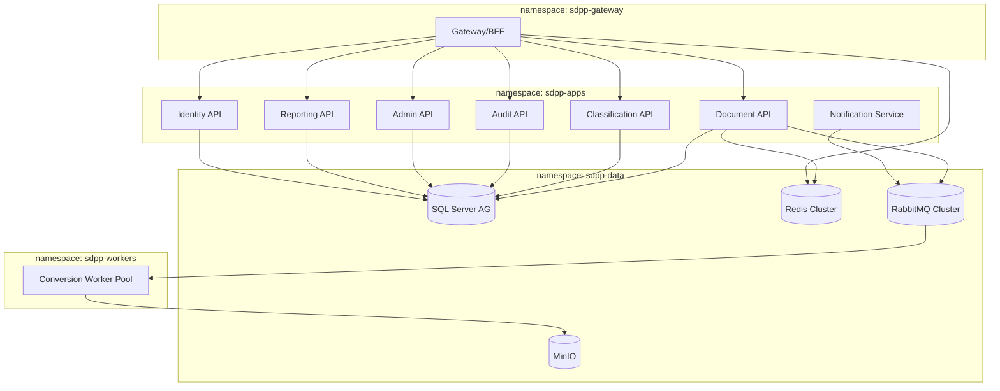

# Arquitectura de despliegue: Docker, Kubernetes, CI/CD

## 1. Estrategia de contenedores

- Imágenes multi-stage: build con SDK completo, imagen final `mcr.microsoft.com/dotnet/aspnet:9.0-alpine`
  (o `chiseled`/distroless) — sin shell ni herramientas de compilación en producción.
- Los workers de conversión usan una imagen dedicada `sdpp-conversion-worker` que empaqueta
  LibreOffice, Ghostscript, Poppler, Tesseract, PDFBox (runtime Java embebido) — **imagen grande
  pero aislada**, nunca comparte imagen con las APIs de negocio (minimiza superficie de ataque de
  cada componente).
- Todas las imágenes: `USER nonroot`, sin capacidades Linux extra, `readOnlyRootFilesystem: true`
  salvo `/tmp` (montado como `emptyDir` con `sizeLimit`).
- Registro de imágenes: Harbor on-prem con escaneo automático (Trivy integrado) y firma de
  imágenes (Cosign/Notary) — Kubernetes solo admite imágenes firmadas (`ImagePolicyWebhook` o
  Kyverno/OPA Gatekeeper).

## 2. Topología de namespaces



- `sdpp-workers` es el único namespace que ejecuta binarios de terceros sobre contenido no
  confiable → **`NetworkPolicy` deny-all egress por defecto**, con excepciones explícitas
  únicamente hacia `sdpp-data` (MinIO, RabbitMQ) y DNS interno. **Sin ruta a Internet, ni
  siquiera para resolución de nombres externos.**
- `sdpp-gateway` es el único namespace con Ingress expuesto a la intranet corporativa (nunca a
  Internet). TLS terminado ahí con certificado emitido por la PKI corporativa.
- Cada namespace tiene su propio `ResourceQuota` y `LimitRange`; `sdpp-workers` tiene límites de
  CPU/memoria estrictos por Pod para mitigar DoS por archivo malicioso (ver STRIDE D1).

## 3. NetworkPolicy (ejemplo — workers sin egress a Internet)

```yaml
apiVersion: networking.k8s.io/v1
kind: NetworkPolicy
metadata:
  name: sdpp-workers-deny-egress-default
  namespace: sdpp-workers
spec:
  podSelector: {}
  policyTypes: [Egress, Ingress]
  ingress:
    - from:
        - namespaceSelector:
            matchLabels: { kubernetes.io/metadata.name: sdpp-data }
  egress:
    - to:
        - namespaceSelector:
            matchLabels: { kubernetes.io/metadata.name: sdpp-data }
    - to:
        - namespaceSelector: {}
          podSelector:
            matchLabels: { k8s-app: kube-dns }
      ports:
        - { protocol: UDP, port: 53 }
```

## 4. PodSecurity / hardening

```yaml
securityContext:
  runAsNonRoot: true
  runAsUser: 10001
  seccompProfile: { type: RuntimeDefault }
  capabilities: { drop: ["ALL"] }
  readOnlyRootFilesystem: true
  allowPrivilegeEscalation: false
```

Namespace `sdpp-workers` etiquetado con `pod-security.kubernetes.io/enforce: restricted`
(Pod Security Admission). Timeout duro por job de conversión implementado como
`activeDeadlineSeconds` en el `Job`/Pod que ejecuta cada conversión aislada (patrón: cada
conversión = un Job de Kubernetes efímero, no un proceso long-running compartido, para máximo
aislamiento entre documentos de distintos usuarios/clasificaciones).

## 5. Autoescalado

| Componente | Mecanismo | Métrica |
|---|---|---|
| Document/Classification/Gateway API | HPA | CPU 60% / RPS vía KEDA (Prometheus adapter) |
| Conversion Worker Pool | KEDA ScaledObject | Longitud de cola RabbitMQ (`sdpp.conversion.queue`) |
| SQL Server | Always On AG con réplica de solo lectura para Reporting | N/A (vertical + réplicas) |
| RabbitMQ | Cluster con quorum queues, 3 nodos mínimo | N/A |

Objetivo de capacidad: 5,000 usuarios concurrentes, 50 conversiones/seg sostenidas — dimensionado
inicial de 6-40 réplicas de `Conversion Worker` según KEDA, con `PodDisruptionBudget` para
mantener disponibilidad durante actualizaciones.

## 6. CI/CD (DevSecOps)

```mermaid
flowchart LR
    PR[Pull Request] --> BUILD[Build + Unit Tests]
    BUILD --> ARCH[Architecture Tests<br/>NetArchTest]
    ARCH --> SAST[SAST - SonarQube]
    SAST --> SCA[SCA - Dependency-Check/Trivy libs]
    SCA --> SECRETS[Secret scanning - Gitleaks]
    SECRETS --> IMG[Build imagen Docker]
    IMG --> SCANIMG[Escaneo de imagen - Trivy]
    SCANIMG --> SIGN[Firma de imagen - Cosign]
    SIGN --> PUSH[Push a Harbor]
    PUSH --> DEPLOYSTG[Deploy a Staging - Helm]
    DEPLOYSTG --> DAST[DAST - OWASP ZAP baseline]
    DAST --> E2E[Pruebas E2E - Playwright]
    E2E --> GATE{Gate de seguridad:<br/>0 High/Critical sin mitigar}
    GATE -->|OK| APPROVAL[Aprobación manual - Change Management]
    APPROVAL --> DEPLOYPROD[Deploy a Producción - Helm, rollout progresivo]
    GATE -->|Falla| BLOCK[Build bloqueado]
```



- Ningún paso llama a un servicio SaaS público de análisis (SonarQube, Harbor, Gitleaks corren
  on-prem o en el runner corporativo) — coherente con el requisito de "sin dependencias
  externas".
- Despliegue a producción usa estrategia **rolling update** con `readinessProbe` estricto y
  `PodDisruptionBudget`; para el módulo `Identity`/`Audit` se prefiere **blue-green** dado su
  criticidad (evitar cualquier ventana de inconsistencia en autenticación o auditoría).
- Migraciones EF Core se ejecutan como `Job` de Kubernetes previo al rollout de la nueva versión
  (init container / pre-upgrade hook de Helm), nunca desde la aplicación en caliente.

## 7. Observabilidad en el clúster
- Prometheus Operator + `ServiceMonitor` por servicio (`/metrics` expuesto vía
  `Microsoft.Extensions.Diagnostics.Metrics` + `prometheus-net`).
- Grafana con dashboards: salud de colas, latencia p95/p99 por operación de conversión, tasa de
  error, tamaño de cola de aprobaciones pendientes, alertas activas.
- Serilog → Fluent Bit (DaemonSet) → Elasticsearch/Seq interno; retención de logs operativos 90
  días (distinto de la retención de auditoría de negocio, que es de 7 años, ver
  [backup-recovery-plan.md](backup-recovery-plan.md)).
- OpenTelemetry Collector centraliza trazas hacia Grafana Tempo/Jaeger interno.
